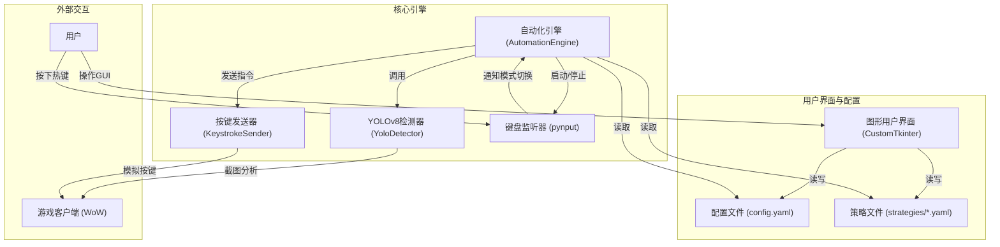

# 《魔兽世界》技能自动化软件 - 架构设计 (YOLOv8版)

## 1. 概述

本文档描述了《魔兽世界》技能自动化软件的架构设计。该软件利用 **YOLOv8** 实时图像识别技术，旨在根据用户配置的职业专精、战斗环境（AOE/单体）和技能优先级，通过识别技能图标的状态（可用/冷却中），并模拟按键自动释放技能。用户通过按下预设的模式按键来激活相应的技能释放策略。

## 2. 系统架构图 (YOLOv8版)



## 3. 模块详细设计

### 3.1. 配置与策略文件 (YAML)

*   **职责**: 集中管理所有用户可配置的参数。
    *   `config.yaml`: 主配置文件，包含YOLO模型路径、训练参数、按键模拟器设置、模式切换热键等全局设置。
    *   `strategies/*.yaml`: 独立的策略文件，定义了特定职业/专精的技能优先级、按键绑定和全局冷却时间。
*   **技术选型**: YAML格式，因其良好的可读性和对复杂数据结构的支持。

### 3.2. 图形用户界面 (GUI)

*   **职责**:
    *   提供用户友好的界面，用于加载、编辑和保存策略文件。
    *   启动和停止自动化引擎。
    *   显示实时的操作日志。
*   **技术选型**: `customtkinter`，一个现代化的Tkinter扩展库。

### 3.3. 自动化引擎 (AutomationEngine)

*   **职责**: 作为项目的核心，协调其他所有组件。
    *   在独立的线程中运行，避免阻塞GUI。
    *   加载主配置和用户选择的策略。
    *   管理键盘监听器，根据用户按键切换内部状态（AOE/单体/停止）。
    *   在激活的模式下，循环调用YOLOv8检测器获取屏幕上可用的技能。
    *   根据当前模式的优先级列表，决定要释放的技能。
    *   调用按键发送器执行技能按键的模拟。
*   **技术选型**: 纯Python逻辑，使用 `threading` 模块进行多线程处理。

### 3.4. YOLOv8检测器 (YoloDetector)

*   **职责**:
    *   加载预先训练好的YOLOv8模型。
    *   根据指令截取全屏或指定区域的图像。
    *   对截图进行推理，识别出所有已知的技能图标及其状态（例如 `frostbolt_ready`, `icelance_cooldown`）。
    *   返回检测到的对象列表，包含技能名称、置信度和边界框坐标。
*   **技术选型**: `ultralytics` YOLOv8库, `Pillow` 用于截图。

### 3.5. 键盘监听器与按键发送器

*   **KeyboardListener**:
    *   **职责**: 全局监听键盘事件，当检测到预设的模式切换热键时，更新自动化引擎的状态。
    *   **技术选型**: `pynput`。
*   **KeystrokeSender**:
    *   **职责**: 接收自动化引擎的指令，精确地模拟键盘按键的按下和释放事件。
    *   **技术选型**: `pynput`，提供可靠的跨平台按键模拟。

## 4. 数据结构示例 (YAML)

**config.yaml:**
```yaml
# YOLO模型配置
yolo_model_path: "runs/detect/train/weights/best.pt"
screen_capture_region: null # [x1, y1, x2, y2] or null for fullscreen

# 模式切换键配置
mode_switch_keys:
  aoe_mode: "f1"
  single_target_mode: "f2"
  stop_casting: "f3"
```

**strategies/frostfire_mage.yaml:**
```yaml
name: "霜火冰法"
class: "法师"
spec: "霜火"
description: "一个基础的霜火冰法输出策略。"
global_cooldown: 1.5

bindings:
  "main_spell": "1"
  "secondary_spell": "2"

aoe_priority:
  - name: "frozenorb"
    key: "main_spell"
  - name: "icelance"
    key: "secondary_spell"

single_target_priority:
  - name: "frostbolt"
    key: "main_spell"
  - name: "icelance"
    key: "secondary_spell"
```

## 5. 用户交互与工作流程

1.  **配置阶段 (通过GUI)**:
    *   用户通过GUI加载或创建策略文件 (`.yaml`)。
    *   在策略文件中，用户定义技能优先级、按键绑定等。
    *   在 `config.yaml` 中，用户可以设置YOLO模型路径和模式切换热键。
2.  **运行阶段**:
    *   用户在GUI点击“启动引擎”。
    *   **自动化引擎**启动，并加载配置和当前策略。
    *   **键盘监听器**开始在后台运行。
    *   用户在游戏中，根据战斗场景按下热键（如 `F1` 切换到AOE模式）。
    *   **自动化引擎**接收到模式切换信号，进入AOE循环。
    *   引擎循环调用 **YOLOv8检测器**，获取屏幕上所有 `_ready` 状态的技能。
    *   引擎根据 `aoe_priority` 列表，从可用技能中选择最高优先级的技能。
    *   引擎命令 **按键发送器** 模拟相应的按键。
    *   技能释放后，引擎等待全局冷却时间，然后开始下一次检测循环，直到模式被切换或引擎被停止。

## 6. 技术栈

*   **编程语言**: Python 3.x
*   **GUI**: customtkinter
*   **图像识别**: ultralytics (YOLOv8)
*   **图像处理**: Pillow
*   **键盘监听/模拟**: pynput
*   **配置文件**: YAML

## 7. 未来扩展性

*   **模型优化**: 持续采集数据并重新训练，以提高YOLO模型的识别准确率和泛化能力。
*   **高级策略逻辑**: 在策略文件中加入更复杂的条件，如当某个Buff存在时才释放某个技能（需要YOLO模型能识别Buff图标）。
*   **多屏支持**: 改进截图逻辑以支持多显示器环境。

